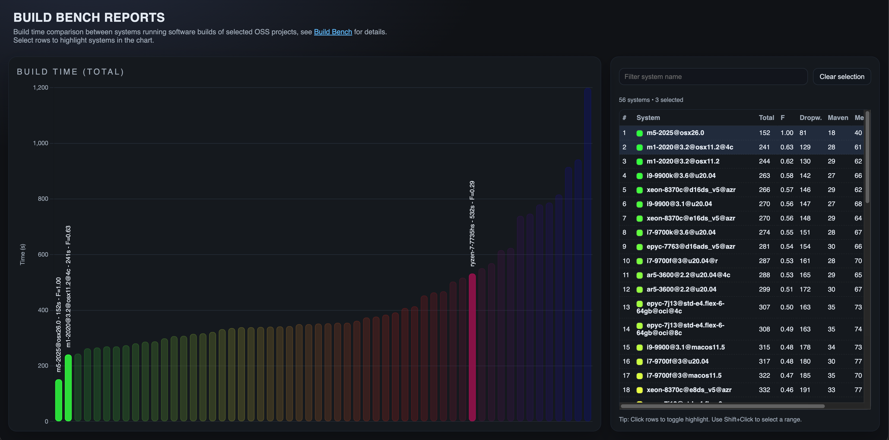

# bb-reports

Generate the the comparison output from all directories containing a [build-bench](https://github.com/mike-seger/build-bench) report
```
./collect-stats.sh .
```

## View Report

In the repository root run:
```
python3 -m http.server 8081
```

then open: [Build Bench Reports](http://localhost:8081/)

It should look look similar to this:


A prepared version based on existing data can be found here:  
https://mike-seger.github.io/bb-reports/
